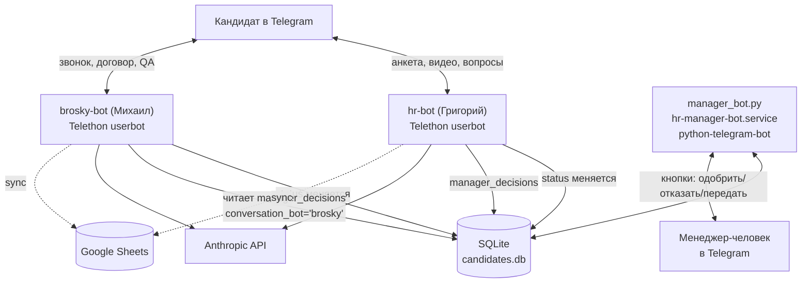

# HR-боты PRO100SCHOOL

Два Telegram-бота на Telethon для найма репетиторов, работающие с общей SQLite-базой на VPS.

- **hr-bot** — "Григорий", первичная воронка: анкета → видеовизитка → проверка → одобрение
- **brosky-bot** — "Михаил", после передачи: авто-звонок → договор → QA-режим → оформление

## Структура

- `hr-bot/` — код Григория + общие модули (`llm.py`, `storage.py`, `sheets.py`, `folders.py`), которые на сервере расшарены между ботами через симлинки из `brosky-bot/`; также `manager_bot.py` — отдельный сервис для человека-менеджера
- `brosky-bot/` — код Михаила (`main.py`, `prompt.py`) и его собственные вспомогательные скрипты
- `scripts/` — `deploy.sh`/`rollback.sh`, формализованный бэкап/откат при ручном деплое (см. "Деплой и откат" ниже)
- `.github/workflows/tests.yml` — CI: прогон тестов на push/PR (не трогает деплой на VPS)

`config.py` в каждой директории читает секреты (токены, ключи, пароли) из `.env`, который **не входит в репозиторий** (см. `.gitignore`) — на сервере он лежит рядом с кодом в `/opt/hr-bot/.env` и `/opt/brosky-bot/.env`. Список переменных — в `.env.example` каждой директории.

## Архитектура



Поток кандидата: `НОВЫЙ → ТЕСТОВОЕ_ОТПРАВЛЕНО → ТЕСТОВОЕ_ПОЛУЧЕНО → ТЕСТОВОЕ_НА_ПРОВЕРКЕ → (решение менеджера через manager_bot.py) → ПЕРЕДАН_МЕНЕДЖЕРУ → (brosky-bot подхватывает по conversation_bot='brosky') → ДОГОВОР_ОТПРАВЛЕН → ДОГОВОР_ПОДПИСАН → АККАУНТ_ПОЛУЧЕН → ОТКРЫТ`, либо `ОТКАЗ`/`ЗАМОРОЗКА` на любом шаге.

`hr-bot` и `brosky-bot` — независимые процессы (systemd), общаются только через таблицы в общей `candidates.db`: `decision_loop()` каждого бота фильтрует `manager_decisions` по `conversation_bot`, гонка между ними исключена архитектурно (не блокировкой, а непересекающимися условиями выборки).

## Схема БД

Таблица `candidates` (SQLite, `storage.py::init_db()`):

| Колонка | Тип | Назначение |
|---|---|---|
| `user_id` | INTEGER PK | Telegram user id кандидата |
| `username`, `name` | TEXT | из Telegram-профиля |
| `subject` | TEXT | предмет из анкеты |
| `status` | TEXT | текущий статус воронки (см. "Поток кандидата" выше) |
| `source` | TEXT | откуда пришёл (hh.ru/рекомендация/telegram) |
| `students_count`, `has_profi_account` | TEXT | из анкеты, легаси-поля |
| `conversation` | TEXT (JSON) | вся история переписки, список `{role, text, time}` |
| `created_at`, `updated_at` | TEXT | ISO-таймстемпы |
| `comment` | TEXT | причины авто-отбора/отказа |
| `score` | INTEGER | скор кандидата 0-10 |
| `reminder_count`, `last_reminder` | | счётчик и время последнего напоминания |
| `slots` | TEXT | **вестигиальное поле** — часть удалённой подсистемы "созвон через слоты", всегда пусто с момента чистки, схема оставлена нетронутой намеренно (не мешает, дропать не входило в объём чистки) |
| `access_hash` | INTEGER | кэш Telethon access_hash, снижает риск `FloodWait` на резолве peer |
| `conversation_bot` | TEXT | `'hr'` или `'brosky'` — чей сейчас черёд отвечать кандидату |
| `auto_qualified` | INTEGER | прошёл ли авто-критерии отбора |
| `video_received_at` | TEXT | когда получено видео (для авто-свипа зависших) |

Таблица `manager_decisions` (создаётся лениво внутри `decision_loop()` каждого бота, не в `init_db()`): `id, candidate_user_id, decision (approved/rejected/transfer/contract_signed), created_at, processed, approved_by`.

Таблица `pending_slots` — **тоже вестигиальная**, часть той же удалённой подсистемы слотов/календаря (было: назначение созвона через ручной обмен временем с менеджером). Схема создаётся в `init_db()`, но с 17.07 ничего в неё не пишет и не читает из неё — оставлена нетронутой из тех же соображений, что и поле `slots`.

## Деплой и откат

Код живёт на VPS в `/opt/hr-bot/` и `/opt/brosky-bot/`, запускается через systemd (`hr-bot.service`, `brosky-bot.service`, `hr-manager-bot.service`). Обновление — вручную, без полноценного CI/CD (CI из `.github/workflows/tests.yml` только прогоняет тесты на push/PR, деплой на сервер не трогает).

`scripts/deploy.sh <hr-bot|brosky-bot> [источник]` — бэкапит текущие `*.py`/`requirements.txt` бота в `/root/deploy_backups/<bot>/<timestamp>/`, затем (если передан источник) применяет новые файлы. Формализует ручной процесс, использовавшийся при каждой правке этой сессии.

`scripts/rollback.sh <hr-bot|brosky-bot> [timestamp|latest]` — восстанавливает файлы из бэкапа и рестартует сервис(ы). Проверено вживую (см. историю коммитов, T11): тривиальная правка задеплоена и полностью откачена без остатка.

Симлинк-схема: `/opt/brosky-bot/{storage,llm,sheets,folders}.py` — симлинки на файлы в `/opt/hr-bot/`. Это важно учитывать при любых изменениях процесса деплоя — например, превращение `/opt/hr-bot` в симлинк на версионированный релиз-каталог (рассматривалось и отклонено при планировании T11) сломало бы эту схему.

## Наблюдаемость

- Логи — через `logging` (уровни info/warning/error), не файлы: процессы под systemd, `journalctl -u hr-bot` / `-u brosky-bot` / `-u hr-manager-bot` — единственное хранилище, второе намеренно не заводили.
- `watchdog.sh` (на сервере, вне этого репозитория, под cron каждые 5 минут) — рестартует зависшие сервисы. Для `hr-bot`/`brosky-bot` смотрит на активность в логах И на heartbeat-файлы (`heartbeat_hr.txt`/`heartbeat_brosky.txt`, обновляются раз в 120с независимо от трафика кандидатов) — рестарт только если оба сигнала плохие, чтобы тихая ночь без сообщений не триггерила ложный рестарт. Для `hr-manager-bot` — только heartbeat (`heartbeat_manager.txt`).
- `brosky-bot`'s `decision_loop()` создаёт `/opt/brosky-bot/.decision_busy` пока реально шлёт кандидату многошаговый пакет (комплимент/условия/аудио/PDF) — `watchdog.sh` не рестартует сервис в этот момент, чтобы не оборвать отправку на середине (живой инцидент с дублями 17.07).
- Алерты менеджеру идут через `send_signal()` в личку `MANAGER_USERNAME` — по LLM-сигналам, по "заморозке" (кандидат не отвечает 72ч+), по таймауту decision-каскада, по ошибкам отправки файлов в авто-пакете.

## Troubleshooting

**Сервис не стартует после деплоя** — `journalctl -u <service> -n 50`, обычно `SyntaxError`/`ImportError` (проверьте `python3 -m py_compile` перед деплоем) или неверный `.env`. Откатите через `scripts/rollback.sh <bot> latest`.

**Тесты падают локально, но проходили на сервере** (или наоборот) — почти всегда это реальные ассеты brosky-bot (`assets/delovoe_predlozhenie.m4a`, `assets/dogovor_partnerskiy.pdf`), которые лежат только на сервере руками (`.gitignore`) — на чистом чекауте их нет, тесты, трогающие эти пути, должны мокать `os.path.exists`/`send_file`, а не полагаться на реальные файлы (см. `test_decision_loop_cascade_not_blocked_by_barrier`).

**`.decision_busy` завис** (файл старше нескольких минут, decision явно не обрабатывается) — проверьте `journalctl -u brosky-bot`, вероятен незавершённый рестарт посреди каскада. Файл можно удалить вручную (`rm /opt/brosky-bot/.decision_busy`), `decision_loop` создаст его заново на следующей итерации.

**Кандидат "завис" в статусе, бот не отвечает** — проверьте `conversation_bot` в БД (кому сейчас принадлежит переписка) и `IGNORE_STATUSES`/`QA_MODE_STATUSES` в `main.py` — часть статусов намеренно не обрабатывается основной воронкой.

**Нужно откатить правку** — `scripts/rollback.sh <bot> latest` (или конкретный timestamp из `/root/deploy_backups/<bot>/`).

## Безопасность и PII

Кандидаты — реальные люди, в БД открытым текстом хранятся имя, username и полная история переписки (`storage.py`). Доступ к серверу и `.env` ограничен; `manager_bot.py` проверяет `ALLOWED_IDS` в каждом хендлере (свой Telegram id — только у менеджера и Броски).

Логин/пароль от аккаунта profi.ru, который кандидат присылает при получении доступа, **не должен** попадать открытым текстом никуда, кроме личного сообщения коллеге, который реально настраивает аккаунт (см. `CREDS_PATTERN` в `main.py` обоих ботов) — раньше утекал ещё в историю переписки и в Google Sheets, починено (история сообщений о репозитории, не для README — см. git log).

Секреты (`TELEGRAM_SESSION_STRING`, `ANTHROPIC_API_KEY`, `BOT_TOKEN`, `google_creds.json`) — только в `.env`/файле кредов на сервере, никогда не в репозитории (`.gitignore` проверен, `git ls-files | grep -i env` пусто).

## Тесты

```bash
cd hr-bot && pip install -r requirements.txt -r requirements-dev.txt && python3 -m pytest tests/ -v
cd brosky-bot && pip install -r requirements.txt -r requirements-dev.txt && python3 -m pytest tests/ -v
```

Тесты изолированы от реальной БД — `conftest.py` каждого бота подменяет `DB_PATH` на временный файл (переменная окружения выставляется до первого импорта `config.py`, `.env`-файл её не перезаписывает) и создаёт чистую схему на каждый тест. Реальный `candidates.db` тесты не трогают ни при каких условиях. Внешние вызовы (Telegram, Anthropic) в тестах, где они нужны, замоканы через `monkeypatch` — сеть не используется.

Покрытие: авто-критерии отбора (`evaluate_auto_criteria`), парсинг анкеты (`parse_anketa_fallback`), сборка промпта и обрезка истории (`llm.py`), хранение истории (`storage.py`), защита от дублирующихся сообщений и гонок (`_recently_sent`, `_wait_and_reserve`, дебаунс QA-режима, каскад `decision_loop`, гонка `old_status`), контроль доступа и роутинг `manager_bot.py`, устойчивость к `FloodWaitError`. Часть тестов явно фиксирует известные ограничения парсера (не баги, а задокументированное поведение) — см. докстринги с пометкой "ИЗВЕСТНОЕ ОГРАНИЧЕНИЕ".

CI (`.github/workflows/tests.yml`) прогоняет оба набора тестов на каждый push/PR в `main` — страховка до того, как правки уйдут на сервер вручную.
